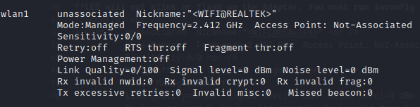
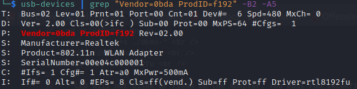

# Realtek 8192FU Linux USB (MONITOR MODE WORKING BUT NO VIF Support)
Forked from [BlightX](https://github.com/BrightX) Github

Original Source Code: [Internet Archive](https://archive.org/details/realtek-8192fu)   

Direct Download：[Download](https://ia801706.us.archive.org/zip_dir.php?path=/18/items/realtek-8192fu.zip)  
** **
# Install
**Debian via Make**  
sudo apt install -y linux-headers-$(uname -r)  
sudo apt install make gcc bc  
cd rtl8192fu  
make -j$(nproc)  
sudo make install  
sudo modprobe 8192fu  

**Debian via dkms**  
sudo apt install -y linux-headers-$(uname -r)  
sudo apt install make gcc bc build-essential dkms -y  
cd rtl8192fu/  
sudo chmod a+x ./dkms-*  
sudo ./dkms-install.sh  
sudo modprobe 8192fu  

** **
**LED will not blink or flash on the Adapter. You must run iwconfig and lsusb to verify if driver is working properly.**  
*iwconfig*  

*usb-devices | grep "Vendor=0bda ProdID=f192" -B2 -A5*  

  
# Uninstall
**Via Make**  
sudo modprobe -r 8192fu  
cd rtl8192fu/  
sudo make uninstall  

**Via dkms**  
sudo modprobe -r 8192fu  
sudo ./dkms-remove.sh  

